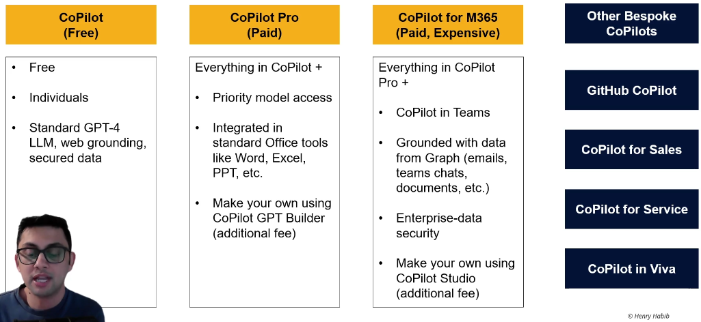
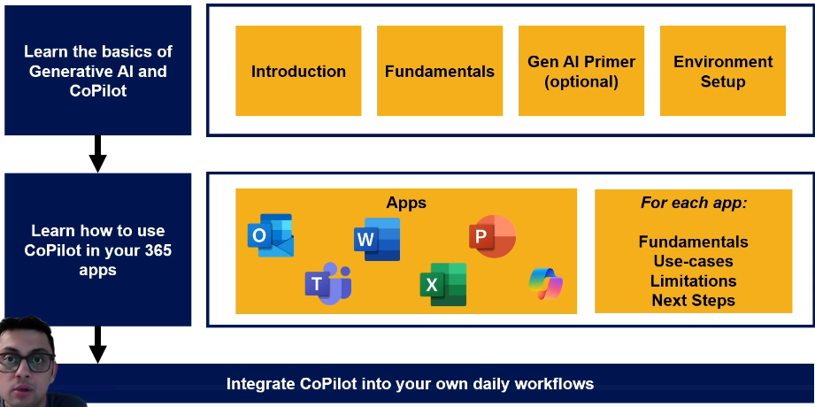

# Introduction

## Lesson 1 Versions of Copilot

For this course you need CP Pro or CP for M365.

Web grounding: The LLM in CP can search the web to answer questions

## Lesson 3 What is this course?

Two points:

1. It is proven that people are 25 percent more productive and the quality of their work is 40 percent better if they use GenAI in their daily workflow.

2. Microsoft is investing heavily to integrate GenAI into their apps.

The goal of this course is to become more productive by using CP effectively.

## Lesson 4 Course Roadmap

