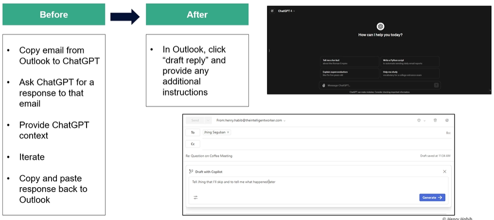
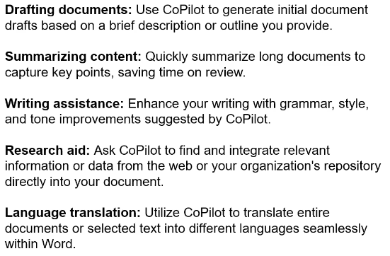
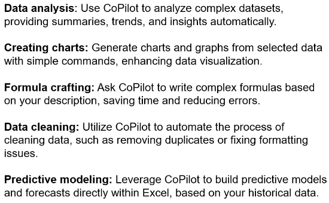
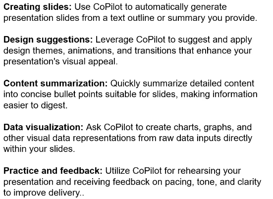
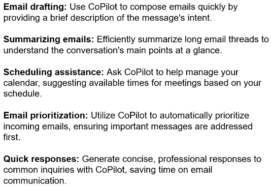
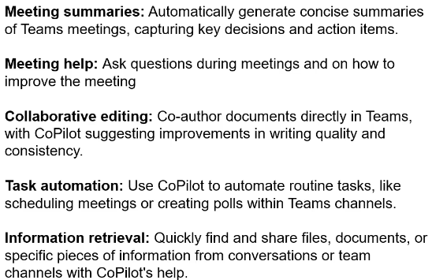
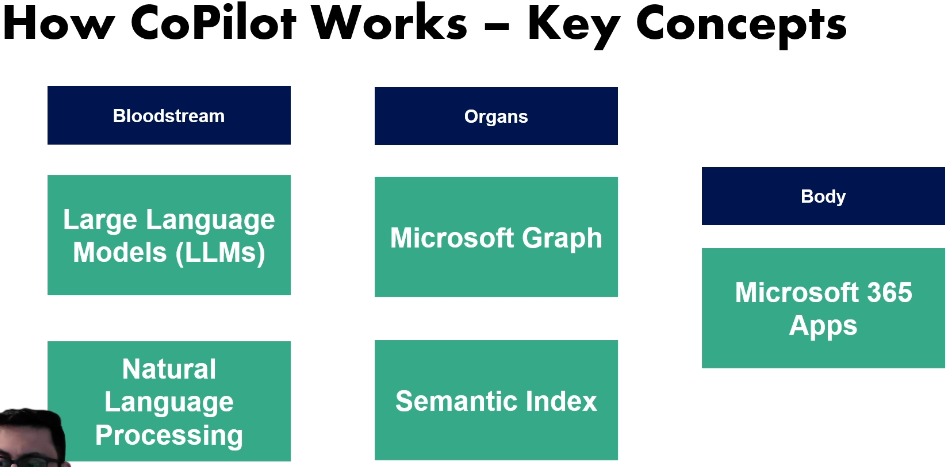
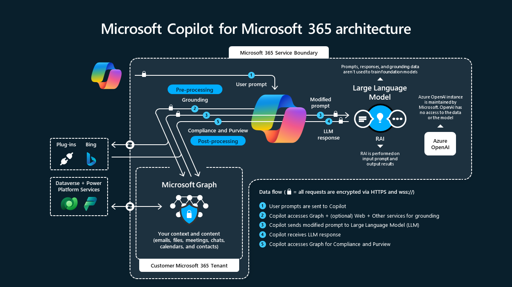

# Fundamentals

## Lesson 9 What is MS Copilot Pro?

Combines these things to make you more productive:

* **OpenAI's GPT 4**: MS uses ChatGPT 4, a LLM that understand nuanced text. MS and OpenAI have partnership so CP is likely to use OpenAI's latest offering.

* **Microsoft Graph**: Collection of data from your emails, files, meeting, chats, etc.

* Apps in which you work: Word, Excel, Outlook, etc.

Iterate is refining your prompt if you didn't like the first response.

## Lesson 10 Feature of CP

* Personalized responses grounded in your data
* Excellent search and retrieve; understands your file structure
* References your files to get answers and then shows where it got the answer
* Real-time monitoring
* Use AI in everyday apps 
* Private and secure
* Multi-modal; can create things other than text such as images, charts, graphic
* Gains personal insights and uses them in suggested prompt such as emailing a person you frequently email

## Lesson 11 What you can do with CP

### Word

### Excel

### PowerPoint

### Outlook

### Teams

## Lesson 12 How CP works

See https://learn.microsoft.com/en-us/training/modules/introduction-microsoft-365-copilot/3-how-copilot-works.

* **LLM**: Class of AI that can understand and generate text. Large because use neural networks that have millions/billions of parameters. Downside, you often don't know how it works and what it is capable of. Also, it's a probabilistic model so you don't get the exact same answer everytime with the same prompt.
* **Natural Language Processing (NLP)**: A subfield of computer science and artificial intelligence that uses machine learning to enable computers to understand and communicate with human language. Unsupervised NLP uses a statistical language model to predict the pattern that occurs when it is fed a non-labeled input. For example, the autocomplete feature in text messaging suggests relevant words that make sense for the sentence by monitoring the user's response
* **Semantic Index**: Makes a map of the data in your MS Graph and establishes connections between the different pieces of data.

In **post-processing**, the repsonse is checked to ensure that it complies with any enterprise requirements that were set, that no offensive language was used, etc.