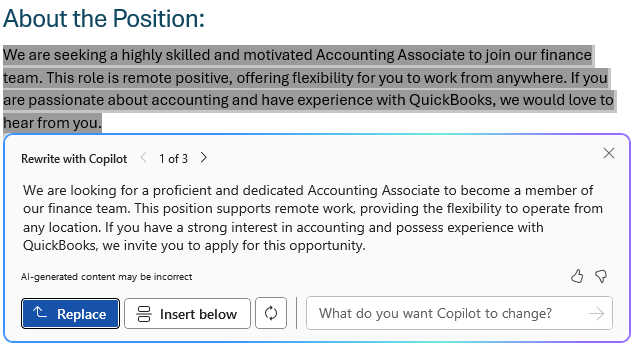
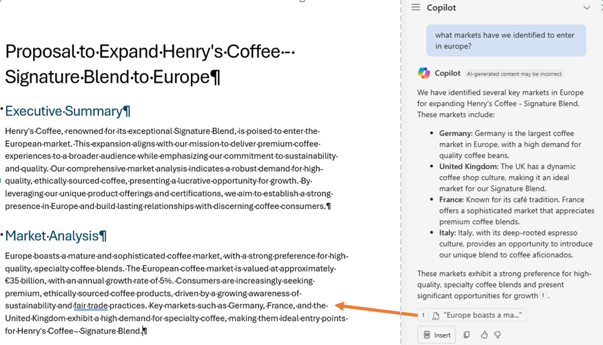
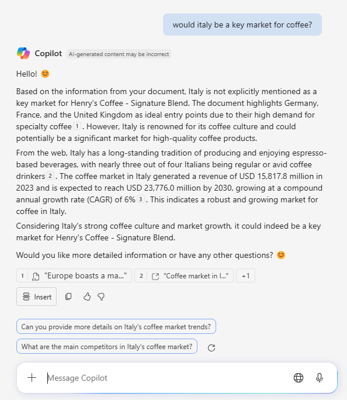

# Using Copilot in Word

## Lesson 27 Draft documents

If you open a blank document that uses a template or particular styles, CP will use them.

You can click the CP icon in the document or use the CP chat. If you use the chat, you will have to click **Insert** to use - extra step.

## Lesson 28 Outlines

Use outline to get better results.

**Prompt**: Create a proposal to expand our coffee product to Europe. Outline: executive summary, market analysis, product offerings. 

When you use the following prompt, info from the class resource doc, Coffee+Details+(2).docx, is used to create the proposal. CP did not pull include the Henry's coffee info with the first prompt.

**Prompt**: Create a proposal to expand Henry's Coffee - Signature Blend coffee to Europe. Outline: executive summary, market analysis, benefits, product offerings. Emphasize certification and committment to sustainability in the product offerings section.

## Lesson 29 Edit text and change tone

To edit a section of text, highlight it and then click the CP icon. Click **Auto rewrite**. You can use the change field to change the tone.

## Lesson 30 Text to table

Highlight the text, click CP icon > Visualize as table.

## Lesson 31 Ask questions about a document

Open the CP chat and then use to ask questions/search the doc. It is a semantic search, a search with meaning instead of a search for matches. For example, what markets have we identified to enter in Europe?

> [!Note]
> CP made mistake becuase Italy not mentioned in document. Maybe because in a previous version of that paragraph Italy was mentioned?

You can also ask questions that don't point to just one section of the doc or are not explicitly explained, such as _What are the key deadlines_ and _Why is Henry's coffee different from other brands?_ 

Other types of questions are _What can I add to the market analysis section to make it more comprehensive?_ Answer may not come from doc. CP may suggest further prompts.  

In the **Message Copilot** field in the chat, click the + icon to view prompts, including ones that you saved.

> [!Note]
> In the video, instructor had a **Change topic** button that I don't have. You can click the hamburger icon at the top of the chat to switch copilots but you lose your previous messages. He suggests changing the topic because the responses can be influenced by previous prompts and responses. If you type 'change topic' as a prompt, CP asks whats you would like to talk about next.

## Lesson 32 Revise edits

You can ask CP to write or revise something for you (write an intro paragraph, add a paragraph about competitor analysis, rewrite the intro paragraph to make it seem) in the chat, you have to manually insert it yourself whatever buttons/options are available in the chat (copy or insert button).

## Lesson 33 Create output artifacts

If you ask for a summary of the document, you can use the response to put in an email, slide deck, etc. You can also ask CP to _create a concise email that summarizes the key points in bullets that I can send to accompany this document_. Having CP write emails is a good example of increased productivity.  

On the fun side, you can ask it to create a jingle, advertising, slogan, etc.

