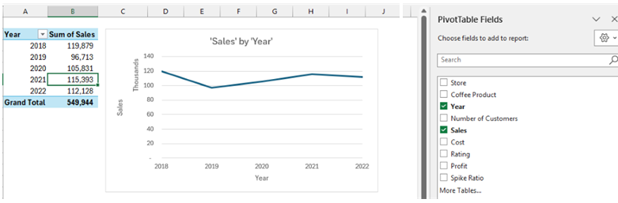
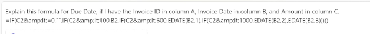
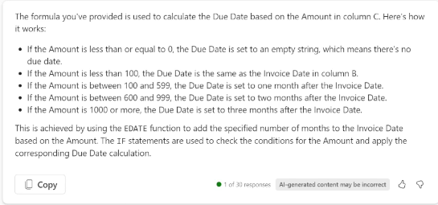
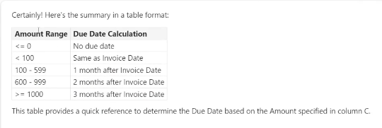
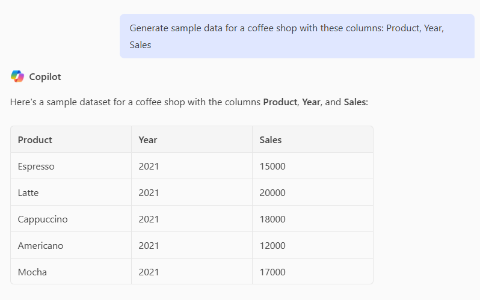

# Using Copilot in Excel
Refer to the [Coffee+Sales+2.xlsx](./assets/Coffee+Sales+2.xlsx) file for this section.

## Lesson 34 Fundamentals
If the Copilot icon is not available (grayed out):
* Ensure that the cluster of cells that you are going to use is formatted as a table (via the ribbon).
* Save the file to the OneDrive that is associated with the account with the CP subscription and enable autosave.
* If CP is still not available, update the license. Go to **File > Account**. Click **Update License**, and the close > reopen Excel to access CP.
* If the above fails, go to microsoft365.com or office.com to create an Excel file.

## Lesson 35 Data general analysis

In CP panel, click **Data Insights** to understand the data in the table. From there, other options are provided, such as show another insights, add all insights to a grid, etc.

You can also ask for specific insights about a column, i.e., _Show me insights about the Number of Customers column, Are there any trends in my data, Are there any outliers?_

You can verify the results of your query using the pivot table related to the graph. Add the graph to another sheet and then view (or edit) the pivot fields.

## Lesson 36 Data Q&A

Instead of relying on a data analyst, you can use CP to crunch numbers to find the answers you need. Ask detailed questions based on the data that is included in the worksheet. For example, _For each store, what where the sales for each coffee product in 2019?_,  _For each store, what where the sales for lattes in 2021?_, or _Which products have the highest average rating in 2018?_

## Lesson 37 Data Filtering
> [!Note]
> CP requires that I click **Apply** to apply the filter whereas when the instructor demonstrates, the filter is automatically applied.

Different ways to ask the same thing:

* Example 1:

  * Filter to where Year = 2018
  * Filter for year 2018
  * Show 2018 data

* Example 2:

  * Remove all filters
  * Show all data*

* Example 3:
  * Filter to Mocha and 2019
  * Show data for 2019 and Mocha
  * Show Mocha data for 2019

## Lesson 38 Data Filtering 2: Filtering and Data Analytics

Combining filtering with data analytic questions does not work at this time.

Instructor used _Filter to Store A, which year had the highest total sales?_ but it did not work for me. It only filtered by Store A after I clicked **Apply**. I then used _In which year did Store A have the highest total sales?_. CP returned the answer. It also just returned answer (no graph/pivot table) for this query: _Filter to Store A and then show the two years that had the highest total sales._

## Lesson 39 Data Formatting

You can add highlighting, bold, and conditional formatting using these types of prompts:

* Highlight the Rating column in red where Rating in below 3.0.

* Make the column headers blue

* Highlight the row in red where Rating is below 3.0

  RESPONSE: Click **APPLY** to Apply a conditional format on cells in Table1 body using the formula below
    * =$G2 < 3
    * Fill color: red
    * Font color: black

* Add green-yellow-red conditional formatting to the Rating  column

You can select **Conditional Formatting > Manage Rules** to change the formatting after you have used CP to format. For example, to change yellow highlights to blue.

If you ask CP to do something it can't, like change the yellow highlights, it might provide info for you to perform the request manually.

## Lesson 40 Data Manipulation

Instructor suggests always using the word _calculated_ when describing a formula. It causes CP to look at formula suggestions.

Example prompts:

* Create a profit column
    
     CP determines that Profit = Sales - Costs and provides that info to you before you can apply the change sheet.

* Add a column called Profit Percentage that is calculated as profit divided by sales.
    
    You can also provide the calculation. With this prompt, the numbers are automatically displayed as a percentage, not some other numbers format.

* To the right of the Rating column, add a column called Rating Band that is calculated as Good if rating is 4 or above or Bad if rating is below 4

* To the right of the Store column, create a column called Store letter that is calculated as the store letter from the Store Column

    Use this type of prompt to create a new column based on data in an existing column.

* Assuming that every 1k spend on marketing increases sales by 1%, add a column that calculates sales based on a 10% increase in marketing

    This is a scenario-based prompt instead of a numbers/formula based.

## Lesson 41 Data Sorting

It is probably quicker to sort manually but you can use CP.

Use 'sort' in the prompt;

* Sort sales in ascending order.

* Sort by Store, Coffee Product, and Year in descending order.

## Lesson 42 Data Visualization

Use 'chart' or 'graph' in the prompt. Use descriptions like total, max, min to accurately describe the data you want to use/visualize.

* Create a bar chart showing the total sales by store

* Create a column chart showing the total sales by store in 2019

* Create a pie chart for 2020 sales by product

* Create a chart that shows total sales by year

  This prompt is vague but CP will select the 'best' chart for the information you want to visualize. In this case, a line graph is selected. 

## Lesson 43 General Use CP to solve Excel issues

Use the general version of CP at https://www.microsoft365.com/ or elsewhere, not the CP in Excel.

Scenario 1:

You were given a spreadsheet that had a formula you didn't understand, you can ask CP to break it down for you. 

For example, you have a spreadsheet with invoice due dates that you don't understand. Some are due one month after the invoice date, whereas others are due 2 or 3 months after the invocie date.

Use the formula from the due date cell in the CP prompt: _Explain this formula for Due Date if Column A is Invoice ID, Column B is Invoice Date and Column C is Amount. =IF...rest of formula_

Youn can then ask CP to summarize the explanation into a table for quicker comprehension.

Scenario 2:

You need sample data.

