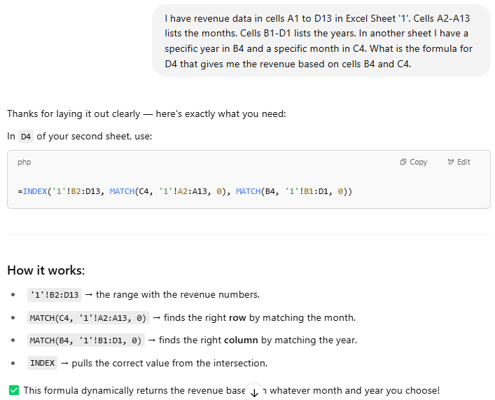
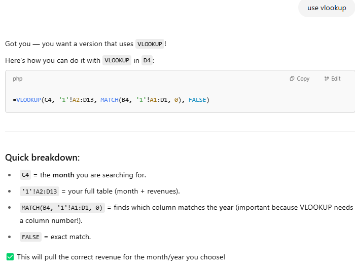
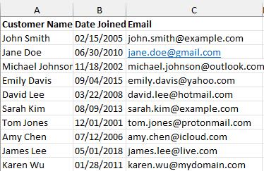
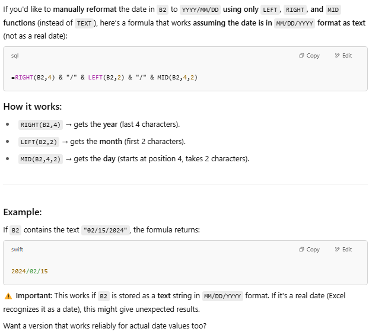
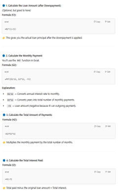
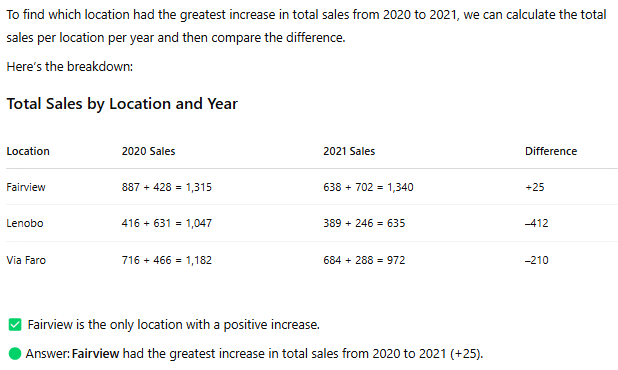
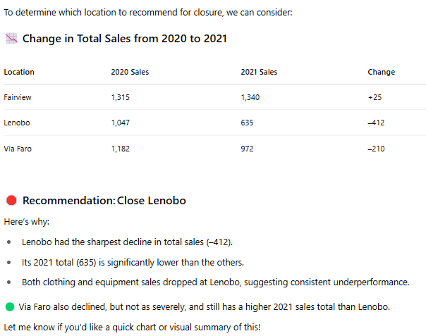

# ChatGPT and Excel

## Lesson 47-48 Simple formulas prompts

* Sum

    _Q_: What is the Excel formula that totals everything from B2 to B13?

    _A_: =SUM(B2:B13)

* Average

    _Q_: What is the Excel formula that averages everything from B2 to B13?
    
    _A_: =AVERAGE(B2:B13)

* Index match

    

    You can make modifications such as _Use VLOOKUP_.

    

## Lesson 49-50 String Manipulation

Assume the spreadsheet contains info from another system. You need to change the string data to meet your database requirements.

Provide CP with context: _In an Excel sheet, there are three columns: Customer Name, Date Joined, and Email. Customer Name column contains the first and last name. Date Joined column is in MM/DD/YYY format._

* First name

    _Q_: Create a formula that extracts the first name from the Customer Name column.

    _A_: =LEFT(A2, FIND(" ", A2) - 1)

* Last name

    _Q_: Do the same thing for the last name.

    _A_: =RIGHT(A2, LEN(A2) - FIND(" ", A2))

* Date joined

    _Q_: Create a formula for date in YYY/MM/DD format from the Date Joined in cell B2.

    _A_: =TEXT(B2, "yyyy/mm/dd")

    This does not work because we don't want to use text so you have to clarify a bit more.

    _Q_: That did not work. Date Joined is not in an Excel data format. Use Left and Right functions in the formula.

    _A_: 

* Sunday before date joined

    For our database, we record the Sunday before the day they joined as the joined date.

    _Q_: I put the formula in cell G2. Create a formula that determines the Sunday date prior to the date in G2.

    _A_: =G2-WEEKDAY(G2,2)

* Email domain

  _Q_: Create a formula that extracts the email domain from the email in cell C2. For example, if the email column contains 'janedoe@gmail.com', extract 'gmail.com'.
  
  _A_: ==RIGHT(C2,LEN(C2)-FIND("@",C2))

## Lesson 51-52 Implied formulas

ChatGPT can combine its knowlegde of Excel formulas with outside info, such as mortgage payments calculations and finance knowledge. 

If you have this info:

* Mortgage amount: 900K
* Downpayment: 10%
* Interest rate: 4.5%
* Number of years: 30

You can ask ChatGPT to create formulas to determine:

* Monthly Payments
* Total Payments
* Total Interest

You could also ask for info to be calculated, but then you wouldn't be able to change the variables.

_Q_: In an Excel spreadsheet I have this mortgage information: 
   * Cell B2 is the Mortgage Amount
   * Cell C2 is the Downpayment Percentage 
   * Cell D2 is the Interest Rate Percentage 
   * Cell E2 is the Number of Years of the Loan

Create formulas to determine the monthly payment, the total amount of payments over the life of the loan, and the total interest paid over the life of the loan.

Note that I didn't specify a specific cell in which to generate the formula. 

_A_: 

It suggested that I include Loan Amount After Downpayment in cell F2. I did that because the rest of the calculations were based on that amount.

## Lesson 53 Sample Data Generator

You can use tabs between column headers to indicate separate columns.

_Q_: Create a table of with 10 rows of fake data that inlcudes First Name   Last Name   Age Email   Phone Number    Company Name.

You can ask for changes to the data:

_Q_: Make these corrections:

* The email domain should be real domains such as Gmail, Outlook, etc.
* The Phone Number Area codes should be different numbers, not all 555.
* Replace the fake company names with Fortune 500 company names.

## Lesson 54  Custom formatted cell types

After you copy the custom format, select Custom in the Format Cell dialog, paste it in the **Type** field, and then click **OK**.

Examples:

* Write a custom formatted cell type that shows numbers in the millions (number divded by a million) with a comma separator and a dollar sign. It should also have a 'M' at the end of every number.

* If the number is negative, it should be red and in brackets.

## Lesson 55 Formula explanations

Similar info is covered in [Lesson 43 General use of CP to solve Excel issues ](./6_excel_and_copilot.md#lesson-43-general-use-cp-to-solve-excel-issues). Explain the spreadsheet and then ask what and how a formula calculates.

* _Q_: In an Excel table, the invoice date is in B2 and the invoce amount is in C2. The invoice due date is in E2. It uses the formula: =IF(and(C2>100,blah)blah/blah). Explain the formula in simple words.

* _Q_: Adjust the formula so that invoice amounts from 601-100 are due in two months and invoice amount greater than 1000 are due in three months.

## Lesson 56 Pivot tables

You can broadly explain the table, describe the pivot table you want to create, and include the table into ChatGPT query. For the simple example below, it wasn't necessary to include the table. 

_Q_: I have an Excel table in cells A1 to C37. I want to create a pivot table that shows the Sales with the Year as columns and the Month as rows. Describe the steps to make the pivot table. (paste table in field.)

Further _Q_: I want to add conditional formatting to the pivot table that highlights any cell where the sales exceed 90,000.

You can also ask ChatGPT to create a different table from a table that you've provided. It is essentially a pivot table but for only that moment in time. If the data in the original table changes, the table that ChatGPT created won't be updated.

## Lesson 57 Analyze Excel data

When you ask for an analysis, ChaptGPT will show you the math but you can ask for the answer only.

* Instructor's query example

    _Q_: I have a table which shows Sales by location, product, and year. Which location had the greatest increase in total sales from 2020 to 2021. (paste table in field.)

* My query 

    _Q_: Based on the following table, which location had the greatest increase in total sales from 2020 to 2021? (pasted table)

    

* Another query

    _Q_: What location would you recommend closing?

     

## Lesson 58 Enable macros in Excel

Ask ChatGPT for info about:

* Enabling macros in Excel
* Writing macros yourself using Visual Basic for Applications (VBA).
* How to access the Developer tab to access VBA.

## Lesson 59 Create simple formatting macro 

Instructor defines simple macros as those that include actions that you could apply using other methods, such as formatting or formulas.

You have a table with these columns:
* Customer ID 
* Customer Name (first and last)
* Revenue (format is $#,###.##)

_Q_: Create an Excel macro where, when I highlight a range of cells, any cell with a value > or = 1,000 is highlighted in yellow and is bolded and undlerlined.

The response will include the code for the macro and how to implement and run the macro in the workbook. 

You can request changes/refinements to the response, such as changing the 1,000 value to 2,000 or changing the highlight color for any value > or = 2,000 to green.

## Lesson 60 Create complex macro

Instructor defines complex macros as macros that execute something that could not be done otherwise.

Using the same table as above.

> [!TIP]
> Instead of citing specific cells to describe a table (A1 to C37), use columns (A-C). This ensures that the response is inlcusive of rows that you add in the future.

_Q_: Customer data is in columns A through C in an Excel sheet called '1'. The columns are Customer ID, Customer Name, and Revenue. Here are the first 5 rows of the data:

Customer ID	Customer Name	Revenue
1	John Smith	$900.00 
2	Jane Doe	$1,200.00 
3	Bob Johnson	$750.00 
4	Sarah Lee	$1,500.00 
5	David Brown	$1,000.00 

Create a macro that uses the customer data to:

  * Create a new sheet called 'VIP_Customers'
  * Populate the sheet with customers that have revenue greater than $2,000.00

As with the simple macro, the code for the complex macro is provides along with instructions to implement and run the macro.

_Refinement Q_: The headers from '1' sheet should be copied to 'VIP_Customers' sheet. Additionally, do not inlcude blank rows between the customers in the 'VIP_Customers' sheet.

