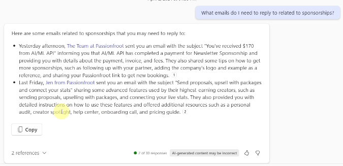
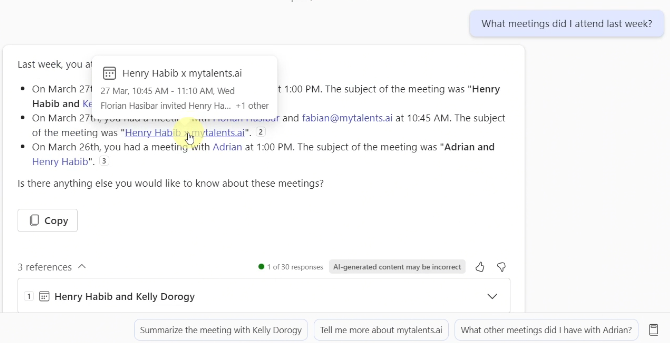
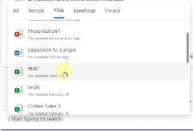
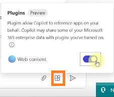

# Microsoft Copilot 365 Chat

## Section 79 Fundamentals of CP 365 Chat

This is feature is grounded with data from Graph to include emails, team chats, company documents in Sharepoint/OneDrive, etc. See [Section 1 Intro](./1_intro.md) and [Section 2 Fundamentals: How CP Works](./2_fundamentals.md#lesson-12-how-cp-works).

## Section 80-81 Ask work-related questions

Responses will include references that you can click for additional info and to verify that the info provided is correct.

**Emails**

* What emails do I need to respond to?
* What emails do I need to reply to related to sponsorships?

    
* Summarize the latest conversation with the Widget vendor regarding the new green widgets.
* Follow up => Did the Widget vendor provide the hex code for the new green color?
* Provide a list of emails in which I am required to take action.

**Meetings**

* What meetings do I have today?
* What meetings did I attend last week?

    

**Specific subjects**

* What's the latest from Sarah Mayhew?
* Since last Friday, is there any new information regarding the October shipments?
* Summarize the marketing and sales strategy for the coffee expansion into Europe.
* What are the documentation deadlines for M1010065?
* Summarize the key points from the Coffee Expansion meeting I had with Sarah and Linda on October 8.

    The link to the meeting should be provided. The transcript of the meeting should available after you open the meeting.

* Take action

    * Create an email to send to Jen and Jamie that summarizes the documentation deadlines for M1010065.

        * CP will provide suggestion regarding the email, such as adding more detail or including others in the email.
        * CP cannot send the email for you. You must copy it and then send the email yourself.

## Lesson 82 Reference files, people, meetings, emails

Use forward slash / to access a menu that includes All, People, Files, Meetings, and Emails. Using references will result in more nuanced, better quality responses.

Or type / and then specify what you are looking for. You can then use the reference in a query. For example, If you reference a Accounting Associate job description documentation, you can then query _Create a list of relevant interview questions that I can ask to confirm that all job requirements are met for Accounting Associate.docx position._ 

Other examples:

* Summarize all emails and Teams chats that I received from /Sarah Mayhew last week.
* Summarize the Word documents that /Sarah Mayhew sent yesterday.
* Suggest 10 slogans for our new chicken sandwich based on the flavor profiles in /referenced_doc
* What were the slogans discussed for the new chicken sandwich in the /referenced_meeting?
* Create a PowerPoint deck based on the key points in /referenced_email 

## Lesson 83 Search the web

You must active the Web content plugin to search the Web in CP.

**Example queries**

* Find some influencers in Europe that can market our coffee product. See /referenced_Coffee_Product.docx.
* Based on /referenced_Accounting_assoc.docx, how much is the starting pay for the position in Colorado?

If you search in M365 CP, you will get the latest info from the web. If you ask the same questions in Word or another MS product, the info is only as recent as the latest update to the LLM.

    

