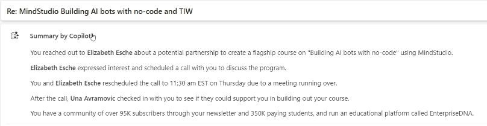

# Using Copilot in Outlook

## Lesson 68 Fundamentals

> [! Note]
> I used [Outlook online](https://outlook.live.com/mail/0/?ui=en-US&rs=US&auth=1) to access Copilot. Couldn't access via desktop version.

You should see _Coach_ and _Draft_ options in the CP menu.

## Lesson 69 Draft Emails

Instructor feels that using CP to draft emails may seems like more work than writing the email yourself but after you get some experience writing the prompts, it will save time. Also maybe sacrifing a little bit of quality for a lot of time savings.

1. Click the CP icon in the email or select Draft Email from CP menu.
2. Indicate what the email should say => tell my team that the proposal for expanding Henry's Coffee into Europe has been approved. Next steps include drafting the marketing strategy and getting the lawyers involved.

   You can write informally 'getting the lawyers involved' versus 'get the legal perspective regarding the expansion'.

3. After the email is generated, you how several options => keep, discard, retry, make shorter/longer, change tone. You can also add additional info that you initially forgot to include by typing in the filed next to the CP icon.

## Lesson 70 Summarize emails and emails threads

Access an email or email thread and then select **Copilot > Summarize**. 

CP does not answer questions about the summary. For example, you can't ask it which email in a thread specific info comes from. 

## Lesson 71-72 Reply to emails

Works similarly to drafting an emails but within the context of the email you are replying to/the email thread.

So if someone emails you to do something (attend a meeting, for example), you can type 'No' in the CP prompt and it will create a more robust email in the tone and length you select.

Of course, you can expand => No but email me the key takeaways.

## Lesson 73 Coaching

You write the emails and then select **Copilot > Coaching** for ideas on how to make it better regarding tone, sentiment, clarity, ect. You can apply all suggestions for CP to create a draft that is based on your content. You can then replace your conent with the CP content.

